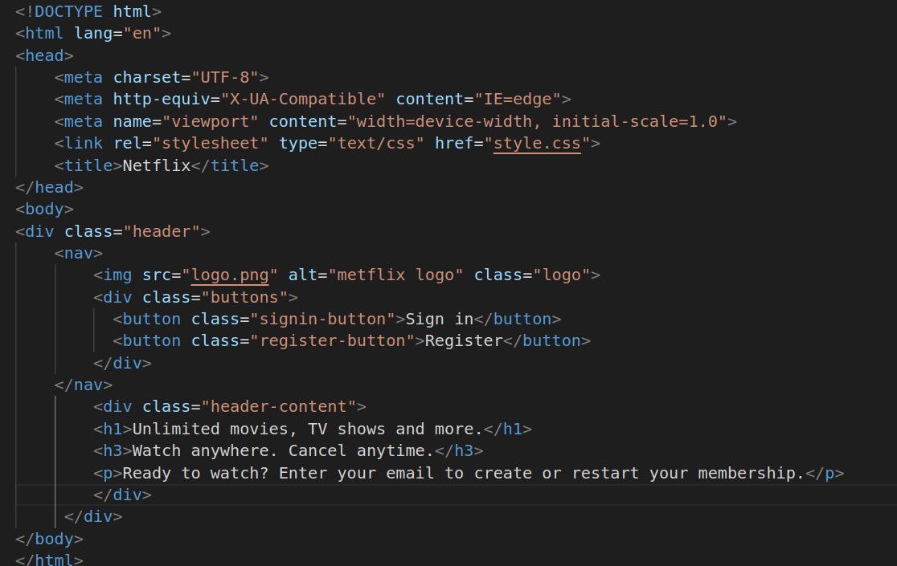
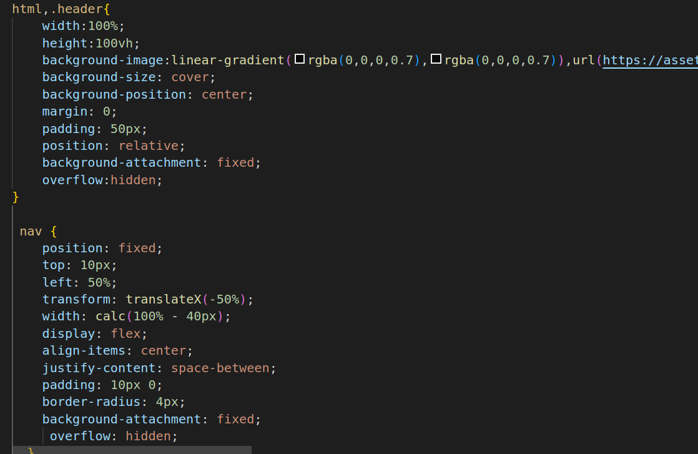
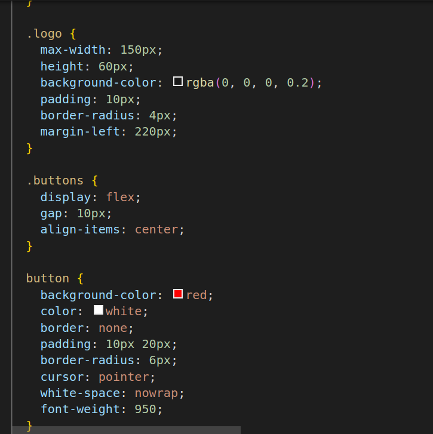

# Netflix
1.
##### Explanation
* The div element is a generic container used to group and style content on a web page.
* The nav element is a semantic element used to define a section of navigation 
* The link rel is telling browser that it is css style sheet.
* button is used to create buttons for user interaction.
* img src is telling the destination to source.
* alt is used to tell what image is used if by any chance that image is not displayed on screen.
* class is used to style different elements.
* h1 and h3 are heading tags and p is paragraph tag.

2.
##### Explanation
* background-image: url this sets the background image of the body to 'background-image.jpg'.
* background-size: cover: This scales the background image to cover the entire body, ensuring it fits the screen.
* background-position: center: This positions the background image at the center of the body.
* overflow: hidden: This hides the vertical scrollbar, preventing scrolling within the entire page.
* position: fixed: This fixes the navigation bar in a specific position on the viewport, so it remains visible even when the user scrolls.
* top: 20px; left: 20px; right: 20px: These properties set the positioning of the navigation bar with 20px spacing from the top, left, and right edges of the viewport.
* display: flex: This makes the navigation bar a flex container, enabling flexible alignment of its contents.
* align-items: center, justify-content: space-between: These properties align the content vertically at the center and horizontally with space between them.
* padding: 10px 0: This adds vertical padding to the navigation bar to create space around its contents.
* background-color: This sets a semi-transparent black background for the navigation bar.
* border-radius: 4px: This adds rounded corners to the navigation bar, creating a softer visual appearance.

3.
##### Explanation
* max-width: 200px: This limits the maximum width of the logo to 200px, preventing it from becoming too large.
* height: auto: This maintains the aspect ratio of the logo while allowing its height to adjust automatically based on its width.
* background-color: This sets a semi-transparent white background for the logo, creating a blending effect with the background.
* padding: 10px: This adds padding around the logo, providing space between the logo content and its background.
* border-radius: 4px: This adds rounded corners to the logo's background, enhancing its visual appeal.
* margin-left: 20px: This adds a 20px margin on the left side of the logo, creating spacing between the logo and other elements.
* main-content Styles:position: absolute: This positions the main content section absolutely within its nearest positioned ancestor.
* top: 50%; left: 50%: This centers the main content section both horizontally and vertically using the transform property.
* transform: translate(-50%, -50%): This adjusts the positioning to center the content while accounting for its own width and height.
* width: 80%; max-width: 500px: These properties set the width of the main content to 80% of its container's width, with a maximum width of 500px.
* padding: 20px: This adds padding around the main content, creating spacing between the content and its background.
* background-color: rgba: This sets a semi-transparent white background for the main content.
* border-radius: 4px: This adds rounded corners to the main content's background.
* color: white: This sets the text color of the content to white.
text-align: center;: This centers the text content horizontally within the main content.
* font-size: 20px: This sets the font size of the text content.
* height: auto;: This allows the main content to adjust its height based on its content.
